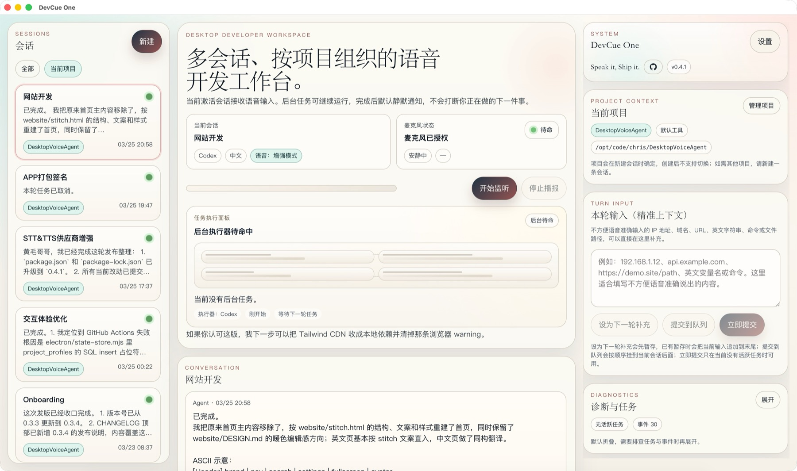

# DevCue One 中文说明

主 README 见：[README.md](./README.md)

官网：<https://devcue.one/>

作者 X：<https://x.com/fukui_wuzhi>

## 项目定位

DevCue One 是一个面向开发者的桌面语音工作台。它将多会话管理、项目配置、语音输入、文本补充、开发工具调用、结果播报、诊断日志，以及 macOS 打包签名流程，统一到一个 Electron + React 应用中。

它不是一个一次性的语音按钮，而是一个长期驻留在桌面上的开发工作台。

## 核心能力

### 多会话

- 同时维护多条历史会话
- 会话支持创建、切换、重命名
- 后台任务运行时，前台仍可切换到别的会话继续工作
- 会话列表支持 `All / Current Project` 过滤

### 项目配置

- 每条会话绑定一个项目配置
- 项目配置保存工作目录、默认提示上下文和使用备注
- 项目可单独覆盖开发工具选择，但不单独维护可执行文件路径
- 会话切换时自动恢复绑定的项目背景

### 语音与文本

- 当前激活会话独占语音输入
- 支持文本直接提交，也支持下一轮补充文本
- 语音确认、错误提示和结果播报都有 fallback 方案
- 本地快捷动作、本轮诊断和任务日志统一回写到会话历史

### 开发工具

当前支持：

- Codex
- Claude Code
- Cursor CLI
- Gemini CLI
- Qwen Code

当前路径模型：

- 全局设置会分别保存每个开发工具的可执行文件路径，并显示桌面端实际运行时解析到的真实路径
- 项目层只选择工具名称，不再单独维护一份路径

### STT / TTS

当前支持：

- Browser / System
- Fake
- OpenAI
- Groq
- Alibaba Model Studio
- Volcengine Speech
- OpenAI-compatible custom HTTP endpoints

### 打包与发布

- macOS 双架构打包
- Developer ID 签名
- Apple notarization
- Gatekeeper 验证

## 产品预览




## 演示视频

- B 站产品演示：<https://www.bilibili.com/video/BV1oJXVBhESc/?share_source=copy_web&vd_source=54186efa4ddd36c2c793ae694ef28b7f>

## 快速开始

```bash
git clone git@github.wzfukui:wzfukui/DevCueOne.git
cd DevCueOne
nvm use 22
npm install
npm run dev:desktop
```

首次启动建议：

1. 选择项目目录
2. 授予麦克风权限
3. 配置 STT / TTS 或暂时切到 `fake`
4. 配置开发工具 CLI
5. 在全局设置里确认“实际运行路径”就是你希望桌面端真正调用的那份二进制

## 常用命令

```bash
npm run dev:desktop
npm run dev
npm run lint
npm test
npm run build
npm run release:local
npm run release:mac:local
```

## 文档索引

- 英文主 README：[`README.md`](./README.md)
- 技术运行手册：`docs/operations/technical-runbook.md`
- Turn Pipeline 技术说明：`docs/architecture/turn-pipeline-and-project-profile-context.md`
- Gemini CLI 对接说明：`docs/integrations/gemini-cli-integration-practice.md`
- 打包自动化：`docs/operations/release-automation.md`
- macOS 签名与公证：`docs/operations/macos-signing-and-notarization.md`
- 产品设计归档：`docs/product/phase-2/product-design.md`

## 安全说明

- 不要把真实 API key、签名证书、`.p8`、`.p12` 和公证参数提交到仓库
- 本地密钥请使用 `.env`、`.env.local`、`.env.signing.local` 或系统环境变量
- 仓库中的签名相关文档和样本文件都是占位示例

## 协议

本项目使用 [MIT License](./LICENSE)。
